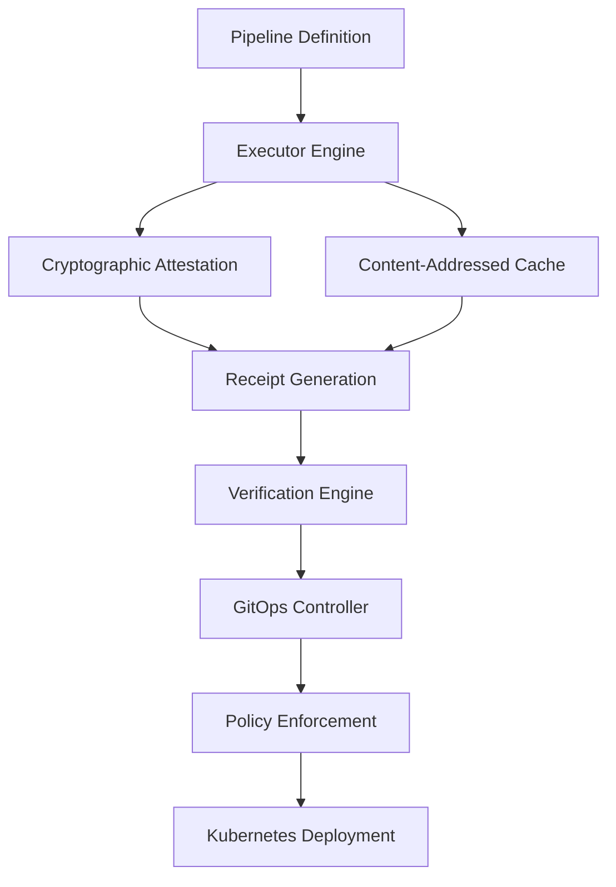

ATTEST is built on several key concepts that work together to provide secure, reproducible, and verifiable CI/CD pipelines. Understanding these concepts is crucial for making the most of ATTEST.

## 1. Architecture Overview



## 2. Pipeline Definition

### 2.1 The `attest.yaml` File

The pipeline definition is the heart of ATTEST. It describes what should be built, how, and in what order.

```yaml
version: "0.1"           # Schema version
name: "my-project"       # Human-readable name

# Global environment variables
env:
  BUILD_ENV: production
  CACHE_ENABLED: "true"

# Global attestation settings
attestation:
  sign_all_steps: true
  verify_dependencies: true
  require_reproducible: false

# Pipeline steps
steps:
  step_name:
    run: "command to execute"
    inputs: ["files", "needed"]
    outputs: ["files", "produced"]
    needs: ["prerequisite_steps"]
    # ... additional configuration
```

### 2.2 Step Dependencies

ATTEST builds a **Directed Acyclic Graph (DAG)** from your step dependencies:

```yaml
steps:
  # These run in parallel (no dependencies)
  lint:
    run: "npm run lint"
  
  test:
    run: "npm test"
  
  # This waits for lint and test
  build:
    run: "npm run build"
    needs: ["lint", "test"]
  
  # This waits for build
  deploy:
    run: "npm run deploy"
    needs: ["build"]
```

**Execution order:**
1. `lint` and `test` run in parallel
2. `build` waits for both to complete
3. `deploy` runs after `build`

### 2.3 Input and Output Tracking

ATTEST tracks all files that go into and come out of each step:

```yaml
steps:
  build:
    run: "npm run build"
    inputs: 
      - "src/"              # Source directory
      - "package.json"      # Dependencies
      - "webpack.config.js" # Build configuration
    outputs:
      - "dist/"             # Built artifacts
```

**Why this matters:**
- **Caching**: Skip steps when inputs haven't changed
- **Reproducibility**: Ensure same inputs produce same outputs
- **Security**: Verify no unexpected files are modified

## 3. Content-Addressed Cache

### 3.1 How It Works

ATTEST uses a sophisticated caching system based on content hashing:

1. **Input Hashing**: All input files are hashed (Blake3)
2. **Command Hashing**: The command and environment are hashed
3. **Cache Key**: Combined hash becomes the cache key
4. **Cache Lookup**: If key exists, reuse previous results
5. **Cache Miss**: Run step and store results

### 3.2 Cache Hierarchy

```
.attest/cache/
├── inputs/           # Hashed input files
├── outputs/          # Cached output artifacts
├── receipts/         # Execution receipts
└── metadata/         # Cache metadata
```

### 3.3 Cache Behavior

```bash
# First run - cache miss
$ attest run
[OK] build (45s) - cache miss
[OK] test (15s) - cache miss

# No changes - cache hit
$ attest run
[OK] build (0.1s) - cache hit
[OK] test (0.1s) - cache hit

# Source change - partial cache miss
$ echo "new code" >> src/main.js
$ attest run
[OK] build (45s) - cache miss (inputs changed)
[OK] test (0.1s) - cache hit (test inputs unchanged)
```

### 3.4 Cache Configuration

```yaml
# Global cache settings
cache:
  enabled: true
  max_size: "10GB"
  compression: true
  retention_days: 30

steps:
  expensive_build:
    run: "cargo build --release"
    cache: true        # Enable caching (default)
    
  always_run:
    run: "deploy.sh"
    cache: false       # Disable caching
```

## 4. Cryptographic Attestation

### 4.1 What is Attestation?

Attestation is the process of creating a cryptographically signed record of what happened during a build. This provides:

- **Integrity**: Proof that results weren't tampered with
- **Authenticity**: Proof of who performed the build
- **Non-repudiation**: Can't deny having performed the build
- **Traceability**: Complete audit trail

### 4.2 Ed25519 Signatures

ATTEST uses Ed25519 cryptographic signatures:

- **Fast**: Extremely fast signing and verification
- **Secure**: Cryptographically strong (256-bit)
- **Deterministic**: Same input always produces same signature
- **Small**: Compact signature size (64 bytes)

### 4.3 Signature Process

1. **Key Generation**: Ed25519 key pair created automatically
2. **Receipt Creation**: Build results serialized to canonical form
3. **Signing**: Receipt signed with private key
4. **Storage**: Signed receipt stored with public key
5. **Verification**: Anyone can verify with public key

```bash
# Generate and view keys
$ attest run --sign
# Keys generated at .attest/keys/

$ ls .attest/keys/
private.key  public.key

# View public key (safe to share)
$ cat .attest/keys/public.key
ed25519-public-key-abc123def456...
```

## 5. Receipts

### 5.1 What is a Receipt?

A receipt is a complete record of a pipeline execution. It includes:

- **Pipeline metadata**: Name, version, timestamp
- **Step results**: What ran, how long it took, exit codes
- **File hashes**: Inputs and outputs with cryptographic hashes
- **Environment**: Variables and system information
- **Signature**: Cryptographic proof of authenticity

### 5.2 Receipt Structure

```yaml
# Example receipt
pipeline_hash: "blake3:abc123def456..."
timestamp: "2024-12-01T14:30:52Z"
total_duration_secs: 127
attest_version: "0.1.2"

steps:
  - name: "build"
    command: "npm run build"
    exit_code: 0
    duration_secs: 45
    inputs:
      - path: "src/"
        hash: "blake3:def456abc123..."
      - path: "package.json"
        hash: "blake3:789xyz456abc..."
    outputs:
      - path: "dist/"
        hash: "blake3:xyz789def456..."

# Cryptographic signature
signature: "ed25519:signature_hex_string..."
signer_public_key: "ed25519:public_key_hex..."
```

### 5.3 Receipt Verification

```bash
# Verify a receipt
$ attest verify receipt_20241201_143052.yaml
[OK] Receipt format valid
[OK] Pipeline hash matches
[OK] All file hashes verified
[OK] Cryptographic signature valid

# Verify without signature check
$ attest verify receipt_20241201_143052.yaml --no-signatures
[OK] Receipt format valid
[OK] Pipeline hash matches
[OK] All file hashes verified
 Signature verification skipped
```

## 6. Determinism and Reproducibility

### 6.1 Deterministic Execution

ATTEST can run in deterministic mode to ensure reproducible builds:

```bash
# Enable deterministic mode
$ attest run --deterministic

# Or configure globally
$ attest config set deterministic true
```

**Deterministic mode:**
- **Fixed timestamps**: All files get consistent timestamps
- **Sorted environments**: Environment variables sorted consistently
- **Stable randomness**: Controlled random number generation
- **Isolated execution**: Consistent execution environment

### 6.2 Reproducible Builds

Reproducible builds mean:
- **Same source** + **Same environment** = **Identical output**
- **Bit-for-bit identical**: Output files are exactly the same
- **Verifiable**: Anyone can reproduce your results

```yaml
# Configure reproducible builds
attestation:
  require_reproducible: true
  
steps:
  build:
    run: "cargo build --release"
    attestation:
      reproducible: true    # This step must be reproducible
```

## 7. Isolation Levels

ATTEST supports different levels of execution isolation:

### 7.1 Process Isolation (Default)

```yaml
steps:
  build:
    run: "npm run build"
    isolation: process  # Default
```

- Runs in separate process
- Shares host filesystem
- Fast and lightweight
- Good for trusted code

### 7.2 Container Isolation

```yaml
steps:
  build:
    run: "npm run build"
    image: "node:18-alpine"
    isolation: container
```

- Runs in Docker container
- Isolated filesystem
- Network isolation
- Good security/performance balance

### 7.3 VM Isolation (Enterprise)

```yaml
steps:
  build:
    run: "npm run build"
    isolation: vm
    vm_image: "ubuntu-22.04"
```

- Full virtual machine
- Complete isolation
- Highest security
- Slower execution

## 8. Pipeline Analysis

### 8.1 Dependency Analysis

ATTEST analyzes your pipeline to optimize execution:

```bash
# Show pipeline structure
$ attest pipeline show --format ascii
```

**Analysis includes:**
- **Critical path**: Steps that determine total execution time
- **Parallelizable groups**: Steps that can run simultaneously
- **Dependency depth**: How many levels of dependencies exist
- **Bottlenecks**: Steps that block multiple other steps

### 8.2 Performance Metrics

```bash
# Analyze performance
$ attest audit analyze --period 30

# Output:
Pipeline Performance Analysis (30 days)
═══════════════════════════════════════

Total Executions: 156
Average Duration: 3m 42s
Cache Hit Rate: 78.4%

Slowest Steps:
1. integration_test (avg: 2m 15s)
2. build (avg: 1m 8s)
3. lint (avg: 23s)

Optimization Opportunities:
- integration_test: Consider parallelization
- build: Enable caching (currently disabled)
```

## 9. Verification Engine

### 9.1 Multi-Layer Verification

ATTEST verifies multiple aspects of your builds:

1. **Syntax Verification**: Pipeline YAML is valid
2. **Dependency Verification**: No circular dependencies
3. **File Verification**: All declared inputs/outputs exist
4. **Hash Verification**: File contents match hashes
5. **Signature Verification**: Cryptographic signatures valid
6. **Policy Verification**: Compliance rules satisfied

### 9.2 Verification Levels

```bash
# Basic verification
$ attest run --verify

# Strict verification
$ attest run --verify --strict

# Custom verification
$ attest run --verify --policy custom-security
```

### 9.3 Trust Model

ATTEST uses a web of trust model:

```bash
# Trust a public key
$ attest keys trust team-member-key.pem

# Verify with trusted keys only
$ attest verify receipt.yaml --trusted-only

# Show trust relationships
$ attest keys list --trusted
```

## 10. Event System

### 10.1 Pipeline Events

ATTEST generates events throughout pipeline execution:

```yaml
# Event types:
- pipeline.started
- step.started
- step.completed
- step.failed
- cache.hit
- cache.miss
- signature.created
- verification.completed
```

### 10.2 Event Handlers

```yaml
# Configure event handlers
events:
  handlers:
    - type: webhook
      url: "https://api.example.com/attest-events"
      events: ["step.failed", "pipeline.completed"]
    
    - type: file
      path: "attest-events.log"
      events: ["*"]
```

## 11. Best Practices

### 11.1 Pipeline Design

1. **Small, Focused Steps**: Each step should do one thing well
2. **Minimize Dependencies**: Reduce coupling between steps
3. **Cache Expensive Operations**: Use caching for slow builds
4. **Parallel Where Possible**: Run independent steps concurrently

### 11.2 Security

1. **Always Sign Important Builds**: Use `--sign` for production
2. **Verify Dependencies**: Use `--verify` to check inputs
3. **Limit Scope**: Don't give steps more access than needed
4. **Regular Key Rotation**: Update cryptographic keys periodically

### 11.3 Performance

1. **Profile Your Pipeline**: Use `attest audit analyze`
2. **Optimize Cache Usage**: Make sure caching is enabled
3. **Minimize I/O**: Don't include unnecessary files in inputs
4. **Use Appropriate Isolation**: Balance security vs. performance

### 11.4 Maintenance

1. **Version Your Pipelines**: Use semantic versioning
2. **Document Decisions**: Comment complex pipeline logic
3. **Monitor Performance**: Track build times and cache rates
4. **Regular Updates**: Keep ATTEST updated

## 12. Integration Points

### 12.1 Version Control

```bash
# Commit pipeline changes
$ git add attest.yaml .attest/config.yaml
$ git commit -m "Update build pipeline"

# Pipeline versioning
$ attest pipeline version --tag v1.2.3
```

### 12.2 CI/CD Integration

```bash
# Export to other CI systems
$ attest pipeline export --format github-actions
$ attest pipeline export --format gitlab-ci
$ attest pipeline export --format jenkins
```

### 12.3 Monitoring Integration

```bash
# Send metrics to monitoring systems
$ attest run --metrics-endpoint https://metrics.example.com

# Generate audit reports
$ attest audit report --format json | jq '.'
```

## 13. Advanced Concepts

### 13.1 Custom Executors

```rust
// Implement custom execution logic
impl CustomExecutor for MyExecutor {
    async fn execute_step(&self, step: &Step) -> Result<StepResult> {
        // Custom execution logic
    }
}
```

### 13.2 Plugin System

```yaml
# Load custom plugins
plugins:
  - name: "custom-notifier"
    path: "./plugins/notifier.so"
    config:
      webhook_url: "https://api.example.com/notify"
```

### 13.3 Distributed Execution

```yaml
# Configure distributed execution
execution:
  mode: distributed
  workers:
    - host: "worker1.example.com"
      capacity: 4
    - host: "worker2.example.com" 
      capacity: 8
```

## 14. Common Questions

### Q: How does ATTEST compare to traditional CI/CD?

**Traditional CI/CD:**
- Files can be modified without detection
- No cryptographic verification
- Limited reproducibility guarantees
- Manual audit trails

**ATTEST:**
- Cryptographic integrity protection
- Automatic signature verification
- Guaranteed reproducible builds
- Complete audit trails

### Q: Can I use ATTEST with my existing tools?

Yes! ATTEST can:
- Export to existing CI/CD formats
- Run alongside existing pipelines
- Integrate with existing deployment tools
- Use existing Docker images and tools

### Q: How does caching work across different machines?

ATTEST cache is content-addressed, so:
- Same inputs = same cache key
- Cache can be shared between machines
- Distributed cache support (enterprise)
- Cloud storage integration available

---

**Ready to build robust pipelines?** -> [Pipeline Configuration](pipeline-configuration.md)

**Want to dive into security?** -> [Attestation & Signatures](attestation.md)