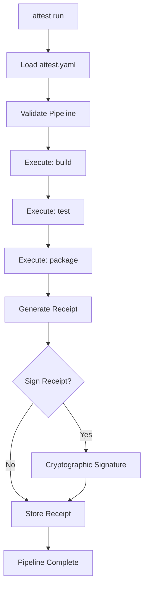

## 1. Your First Pipeline in 5 Minutes

Let's create and run your first ATTEST pipeline! This guide will take you from zero to a working, cryptographically signed build pipeline.

## 2. Quick Start

### 2.1 Step 1: Initialize Your Project

```bash
# Navigate to your project directory
cd your-existing-project

# Or create a new test project
mkdir my-first-attest-project
cd my-first-attest-project

# Initialize ATTEST
attest init
```

This creates:
- 📁 `.attest/` - ATTEST configuration and cache
-  `attest.yaml` - Your pipeline definition
-  `.attestignore` - Files to exclude from builds

### 2.2 Step 2: Examine the Generated Pipeline

```bash
# Look at your pipeline
cat attest.yaml
```

You'll see something like:
```yaml
version: "0.1"
name: "my-first-project"

steps:
  build:
    run: "echo 'Building application...' && sleep 2"
    inputs: ["src/"]
    outputs: ["build/"]
    
  test:
    run: "echo 'Running tests...' && sleep 1"
    inputs: ["build/", "tests/"]
    needs: ["build"]
    
  package:
    run: "echo 'Creating package...' && sleep 1"
    inputs: ["build/"]
    outputs: ["dist/"]
    needs: ["test"]
```

### 2.3 Step 3: Run Your Pipeline

```bash
# Basic run
attest run

# Run with verification and cryptographic signing
attest run --verify --sign

# Show what would run without executing
attest run --dry-run
```

### 2.4 Step 4: Verify Your Results

```bash
# View execution history
attest audit history

# Verify the cryptographic signature
attest verify receipt_*.yaml --check-signatures

# Show pipeline visualization
attest pipeline show --format ascii
```

 **Congratulations!** You've just run your first cryptographically signed, reproducible build pipeline!

## 3. Understanding What Happened

### 3.1 Pipeline Execution Flow



### 3.2 Generated Artifacts

After running your pipeline, you'll find:

```bash
# List all generated files
ls -la .attest/

# Receipt files (execution records)
ls -la .attest/receipts/
# receipt_20241201_143052.yaml

# Cache files (for faster subsequent runs)
ls -la .attest/cache/

# Cryptographic keys (if signing enabled)
ls -la .attest/keys/
# private.key  public.key
```

## 4. Customizing Your Pipeline

### 4.1 Real-World Example: Node.js Application

Let's create a realistic pipeline for a Node.js project:

```yaml
version: "0.1"
name: "nodejs-web-app"

env:
  NODE_ENV: production
  NPM_CONFIG_CACHE: .attest/cache/npm

steps:
  install:
    run: "npm ci"
    inputs: ["package.json", "package-lock.json"]
    outputs: ["node_modules/"]
    cache: true

  lint:
    run: "npm run lint"
    needs: ["install"]
    inputs: ["src/", "node_modules/"]
    outputs: []

  test:
    run: "npm test"
    needs: ["install"]
    inputs: ["src/", "tests/", "node_modules/"]
    outputs: ["coverage/"]

  build:
    run: "npm run build"
    needs: ["lint", "test"]
    inputs: ["src/", "node_modules/"]
    outputs: ["dist/"]
    env:
      NODE_ENV: production

  package:
    run: |
      tar -czf app-${CI_COMMIT_SHA:-latest}.tar.gz dist/
      echo "Package created: app-${CI_COMMIT_SHA:-latest}.tar.gz"
    needs: ["build"]
    inputs: ["dist/"]
    outputs: ["*.tar.gz"]
```

Save this as `attest.yaml` and run:

```bash
attest run --verify --sign --parallel 2
```

### 4.2 Real-World Example: Rust Application

For Rust projects:

```yaml
version: "0.1"
name: "rust-cli-tool"

env:
  CARGO_TERM_COLOR: always
  RUST_BACKTRACE: 1

steps:
  check:
    run: "cargo check --all-targets"
    inputs: ["src/", "Cargo.toml", "Cargo.lock"]
    outputs: ["target/debug/"]
    cache: true

  clippy:
    run: "cargo clippy -- -D warnings"
    needs: ["check"]
    inputs: ["src/", "Cargo.toml"]
    outputs: []

  test:
    run: "cargo test --all"
    needs: ["check"]
    inputs: ["src/", "tests/", "Cargo.toml"]
    outputs: ["target/debug/deps/"]

  build:
    run: "cargo build --release"
    needs: ["clippy", "test"]
    inputs: ["src/", "Cargo.toml", "Cargo.lock"]
    outputs: ["target/release/"]
    timeout_secs: 300

  package:
    run: |
      mkdir -p dist/
      cp target/release/my-tool dist/
      tar -czf my-tool-linux.tar.gz -C dist my-tool
    needs: ["build"]
    inputs: ["target/release/my-tool"]
    outputs: ["dist/", "*.tar.gz"]
```

## 5. Pipeline Visualization

### 5.1 ASCII Visualization
```bash
attest pipeline show --format ascii

# Output:
# ┌─────────┐    ┌──────┐    ┌─────────┐
# │ install │───▶│ lint │───▶│  build  │
# └─────────┘    └──────┘    └─────────┘
#      │                           ▲
#      ▼                           │
# ┌──────────┐                ┌────────┐
# │   test   │───────────────▶│package │
# └──────────┘                └────────┘
```

### 5.2 Detailed Information
```bash
attest pipeline show --details --with-timing

# Shows:
# - Step dependencies
# - Input/output files
# - Execution time
# - Cache status
```

### 5.3 Export to Other Formats
```bash
# Generate Mermaid diagram
attest pipeline show --format mermaid > pipeline.mmd

# Generate DOT graph
attest pipeline show --format dot > pipeline.dot
```

## 6. Working with Cryptographic Signatures

### 6.1 Understanding Signatures

When you run with `--sign`, ATTEST:

1. **Generates Key Pair**: Ed25519 cryptographic keys
2. **Signs Receipt**: Creates tamper-proof execution record
3. **Enables Verification**: Others can verify authenticity

### 6.2 Key Management

```bash
# View your public key
cat .attest/keys/public.key

# Export public key for sharing
attest keys export --public > team-public-key.pem

# Import a team member's public key
attest keys import --public team-public-key.pem
```

### 6.3 Verification Workflow

```bash
# Run pipeline with signing
attest run --verify --sign

# Someone else can verify your work
attest verify receipt_20241201_143052.yaml --check-signatures

# Verify with external public key
attest verify receipt_20241201_143052.yaml \
  --public-key team-public-key.pem \
  --check-signatures
```

## 7. Performance and Caching

### 7.1 Understanding the Cache

ATTEST automatically caches:
- **Input hashes**: Detects when files haven't changed
- **Output artifacts**: Reuses previous build results
- **Step results**: Skips unchanged pipeline steps

### 7.2 Cache in Action

```bash
# First run (cold cache)
time attest run --verify --sign
# [OK] install (30s)
# [OK] test (15s) 
# [OK] build (45s)
# Total: 90s

# Second run (warm cache)
time attest run --verify --sign
# [OK] install (cached, 0.1s)
# [OK] test (cached, 0.1s)
# [OK] build (cached, 0.1s)
# Total: 0.3s
```

### 7.3 Cache Management

```bash
# View cache status
attest cache status

# Clear specific step cache
attest cache clear --step build

# Clear all cache
attest clean --all

# Disable cache for a run
attest run --no-cache
```

## 8. Debugging and Troubleshooting

### 8.1 Verbose Output

```bash
# See detailed execution logs
attest --verbose run

# Show what files are being tracked
attest --verbose run --dry-run

# Debug specific step
attest --verbose run --step build
```

### 8.2 Pipeline Validation

```bash
# Validate pipeline syntax
attest pipeline validate

# Strict validation with security checks
attest pipeline validate --strict --security-check

# Check for common issues
attest pipeline validate --detailed
```

### 8.3 Common Issues and Solutions

#### Issue: "Command not found"
```bash
# Solution: Ensure your commands are available
which npm node cargo

# Or use absolute paths
run: "/usr/local/bin/npm ci"
```

#### Issue: "Input file not found"
```bash
# Solution: Check your inputs exist
ls -la src/ package.json

# Or make inputs optional
inputs: ["src/", "package.json?"]  # ? makes it optional
```

#### Issue: "Permission denied"
```bash
# Solution: Fix permissions
chmod +x scripts/build.sh

# Or run with proper permissions
run: "bash scripts/build.sh"
```

## 9. Next Level: Advanced Features

### 9.1 Environment Variables

```yaml
# Global environment
env:
  NODE_ENV: production
  API_URL: https://api.example.com

steps:
  build:
    run: "npm run build"
    env:
      # Step-specific environment
      BUILD_TARGET: web
      OPTIMIZATION: true
```

### 9.2 Conditional Execution

```yaml
steps:
  test:
    run: |
      if [ "$NODE_ENV" = "production" ]; then
        npm run test:full
      else
        npm run test:quick
      fi
```

### 9.3 Working Directories

```yaml
steps:
  frontend:
    run: "npm run build"
    working_dir: "frontend/"
    inputs: ["frontend/src/"]
    outputs: ["frontend/dist/"]

  backend:
    run: "cargo build --release"
    working_dir: "backend/"
    inputs: ["backend/src/"]
    outputs: ["backend/target/release/"]
```

### 9.4 Docker Integration

```yaml
steps:
  build:
    run: "npm run build"
    image: "node:18-alpine"
    inputs: ["package.json", "src/"]
    outputs: ["dist/"]
```

## 10. Best Practices

### 1. **Organize Your Pipeline**
- Use descriptive step names
- Group related operations
- Keep steps focused and single-purpose

### 2. **Manage Dependencies**
- Minimize cross-step dependencies
- Use parallel execution where possible
- Cache expensive operations

### 3. **Handle Inputs/Outputs**
- Be specific about what files you need
- Don't include unnecessary files
- Use `.attestignore` for large directories

### 4. **Secure Your Pipeline**
- Always use `--verify --sign` for important builds
- Keep private keys secure
- Share public keys with your team

### 5. **Monitor Performance**
- Use `--parallel` for multi-core systems
- Monitor cache hit rates
- Profile slow steps

## 11. What's Next?

Now that you've mastered the basics, explore:

1. **[Core Concepts](concepts.md)** - Deep dive into ATTEST architecture
2. **[Pipeline Configuration](pipeline-configuration.md)** - Advanced pipeline features  
3. **[Attestation & Signatures](attestation.md)** - Master cryptographic security
4. **[GitOps & Kubernetes](gitops.md)** - Deploy to production securely

### Try These Examples

```bash
# Multi-language project
attest init --template polyglot

# Microservices architecture
attest init --template microservices

# Machine learning pipeline
attest init --template ml-pipeline

# Web application with deployment
attest init --template web-app-deploy
```

---

**Ready for more advanced concepts?** -> [Core Concepts](concepts.md)

**Want to dive into configuration?** -> [Pipeline Configuration](pipeline-configuration.md)