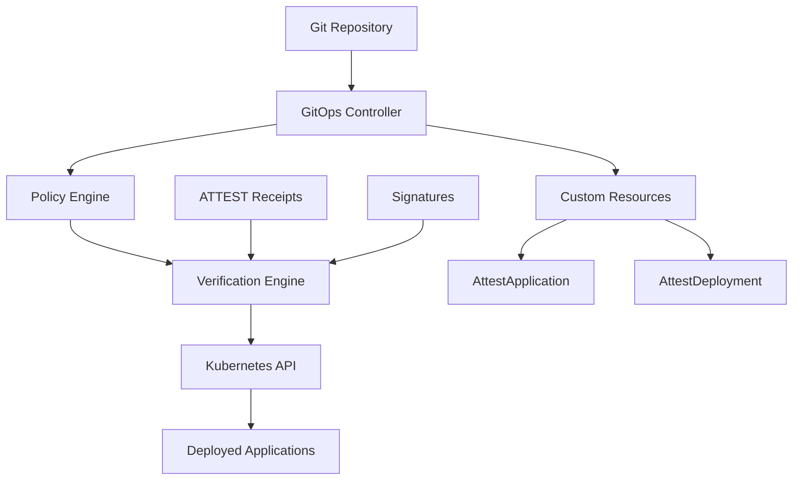

## 1. Overview

ATTEST provides native GitOps capabilities with full Kubernetes integration, enabling secure, automated deployments with cryptographic verification at every step.

## 2. GitOps Controller Architecture



## 3. Custom Resource Definitions

### 3.1 AttestApplication

Defines an application managed by the ATTEST GitOps controller:

```yaml
apiVersion: attest.continuu.ms/v1
kind: AttestApplication
metadata:
  name: web-app
  namespace: production
spec:
  source:
    repoUrl: https://github.com/company/web-app
    targetRevision: v1.2.3
    path: k8s
  destination:
    namespace: web-app
  verification:
    enabled: true
    trustedKeys:
      - "ed25519-company-ci-key"
    policy: Strict
    receiptVerification:
      required: true
      requiredAttestations: ["build", "test", "security-scan"]
  syncPolicy:
    automated:
      prune: true
      selfHeal: false
```

### 3.2 AttestDeployment

Represents a specific deployment operation:

```yaml
apiVersion: attest.continuu.ms/v1
kind: AttestDeployment
metadata:
  name: web-app-v124
  namespace: production
spec:
  applicationRef:
    name: web-app
  strategy: Canary
  canary:
    weight: 5
    analysis:
      templates:
        - templateName: http-success-rate
        - templateName: http-latency-p95
    promotion:
      autoPromotion:
        enabled: true
        successCriteria:
          minDuration: "5m"
          successRate: 0.995
```

## 4. Deployment Strategies

### 4.1 Rolling Update

Default strategy for zero-downtime deployments:

```yaml
spec:
  strategy: RollingUpdate
  rollingUpdate:
    maxUnavailable: 25%
    maxSurge: 25%
```

### 4.2 Blue-Green Deployment

Complete environment switch for critical applications:

```yaml
spec:
  strategy: BlueGreen
  blueGreen:
    activeService: web-app-active
    previewService: web-app-preview
    autoPromotionEnabled: false
    scaleDownDelaySeconds: 300
```

### 4.3 Canary Deployment

Gradual rollout with automated analysis:

```yaml
spec:
  strategy: Canary
  canary:
    weight: 10
    maxWeight: 50
    steps:
      - setWeight: 10
      - pause: {duration: 5m}
      - setWeight: 25
      - pause: {duration: 10m}
      - setWeight: 50
      - pause: {duration: 15m}
```

## 5. Verification Engine Integration

### 5.1 Cryptographic Verification

Every deployment is cryptographically verified:

```bash
# Verification process
1. Clone Git repository
2. Locate ATTEST receipts
3. Verify cryptographic signatures
4. Check trusted key chains
5. Validate receipt contents
6. Apply to Kubernetes
```

### 5.2 Policy Enforcement

Integrated with OPA/Gatekeeper for policy compliance:

```yaml
verification:
  policyValidation:
    policyBundle: "https://policies.company.com/security-bundle"
    fail_on_violation: true
    required_policies:
      - "attest-security"
      - "attest-deployment" 
      - "attest-compliance"
```

## 6. Installation and Setup

### 6.1 Prerequisites

```bash
# Kubernetes cluster with admin access
kubectl version --client

# Helm 3.x
helm version

# ATTEST CLI
attest version
```

### 6.2 Install GitOps Controller

```bash
# Add ATTEST Helm repository
helm repo add attest https://charts.attest.continuu.ms
helm repo update

# Install controller
helm install attest-gitops attest/gitops-controller \
  --namespace attest-system \
  --create-namespace \
  --set controller.verification.enabled=true \
  --set controller.policies.enabled=true
```

### 6.3 Manual Installation

```bash
# Apply CRDs
kubectl apply -f https://raw.githubusercontent.com/attest-ci/attest/main/deploy/crds/

# Apply RBAC
kubectl apply -f https://raw.githubusercontent.com/attest-ci/attest/main/deploy/rbac/

# Deploy controller
kubectl apply -f https://raw.githubusercontent.com/attest-ci/attest/main/deploy/controller/
```

## 7. Configuration

### 7.1 Controller Configuration

```yaml
# attest-gitops-config ConfigMap
apiVersion: v1
kind: ConfigMap
metadata:
  name: attest-gitops-config
  namespace: attest-system
data:
  config.yaml: |
    namespace: attest-system
    syncIntervalSeconds: 300
    verificationEnabled: true
    trustedKeys:
      - "ed25519-key-1234567890abcdef"
    webhookSecret: "webhook-secret-123"
    policies:
      enabled: true
      bundle: "https://policies.company.com/bundle"
```

### 7.2 RBAC Configuration

The controller requires these permissions:

```yaml
apiVersion: rbac.authorization.k8s.io/v1
kind: ClusterRole
metadata:
  name: attest-gitops-controller
rules:
- apiGroups: ["attest.continuu.ms"]
  resources: ["attestapplications", "attestdeployments"]
  verbs: ["get", "list", "watch", "create", "update", "patch", "delete"]
- apiGroups: [""]
  resources: ["configmaps", "secrets", "services", "pods"]
  verbs: ["get", "list", "watch", "create", "update", "patch", "delete"]
- apiGroups: ["apps"]
  resources: ["deployments", "replicasets"]
  verbs: ["get", "list", "watch", "create", "update", "patch", "delete"]
```

## 8. Monitoring and Observability

### 8.1 Prometheus Metrics

The controller exports comprehensive metrics:

```
# Applications
attest_gitops_applications_total
attest_gitops_applications_by_phase_synced
attest_gitops_application_sync_duration_seconds

# Deployments  
attest_gitops_deployments_total
attest_gitops_deployment_duration_seconds
attest_gitops_deployments_success_total

# Verifications
attest_gitops_verifications_total
attest_gitops_signature_verifications_failed_total
attest_gitops_policy_validations_total
```

### 8.2 Health Checks

```bash
# Liveness probe
curl http://controller:8081/health

# Readiness probe  
curl http://controller:8081/ready

# Metrics endpoint
curl http://controller:8080/metrics
```

### 8.3 Structured Logging

```json
{
  "timestamp": "2024-01-15T10:30:00Z",
  "level": "INFO",
  "target": "attest_gitops::controller",
  "message": "Successfully reconciled AttestApplication: default/my-app",
  "fields": {
    "application": "my-app",
    "namespace": "default",
    "phase": "Synced",
    "verification_status": "Verified"
  }
}
```

## 9. Multi-Cluster Deployment

### 9.1 Cluster Registration

```bash
# Register additional clusters
attest gitops cluster add staging \
  --kubeconfig ~/.kube/staging-config \
  --context staging-cluster

attest gitops cluster add production \
  --kubeconfig ~/.kube/prod-config \
  --context prod-cluster
```

### 9.2 Cross-Cluster Applications

```yaml
apiVersion: attest.continuu.ms/v1
kind: AttestApplication
metadata:
  name: multi-cluster-app
spec:
  destinations:
    - cluster: staging
      namespace: app-staging
    - cluster: production  
      namespace: app-production
  source:
    repoUrl: https://github.com/company/app
    path: k8s/overlays
```

## 10. Security Considerations

### 10.1 Network Policies

```yaml
apiVersion: networking.k8s.io/v1
kind: NetworkPolicy
metadata:
  name: attest-controller-netpol
spec:
  podSelector:
    matchLabels:
      app: attest-gitops-controller
  policyTypes:
  - Ingress
  - Egress
  ingress:
  - from:
    - namespaceSelector:
        matchLabels:
          name: attest-system
    ports:
    - protocol: TCP
      port: 8080
```

### 10.2 Pod Security Standards

```yaml
apiVersion: v1
kind: Pod
metadata:
  name: attest-controller
spec:
  securityContext:
    runAsNonRoot: true
    runAsUser: 65534
    fsGroup: 65534
  containers:
  - name: controller
    securityContext:
      allowPrivilegeEscalation: false
      readOnlyRootFilesystem: true
      capabilities:
        drop:
        - ALL
```

## 11. Troubleshooting

### 11.1 Common Commands

```bash
# Check application status
kubectl get attestapplications -A

# View application details
kubectl describe attestapplication myapp

# Check controller logs
kubectl logs -n attest-system deployment/attest-gitops-controller

# View events
kubectl get events --sort-by='.lastTimestamp' -A
```

### 11.2 Debug Mode

```bash
# Enable debug logging
kubectl patch configmap attest-gitops-config -n attest-system \
  --patch '{"data":{"log_level":"debug"}}'

# Restart controller
kubectl rollout restart deployment/attest-gitops-controller -n attest-system
```

## 12. Integration Examples

### 12.1 GitHub Actions

```yaml
name: Deploy with ATTEST GitOps
on:
  push:
    branches: [main]

jobs:
  deploy:
    runs-on: ubuntu-latest
    steps:
      - uses: actions/checkout@v4
      
      - name: Build and attest
        run: attest run --sign --verify
          
      - name: Update GitOps repository
        run: |
          yq e '.spec.template.spec.containers[0].image = "myapp:${{ github.sha }}"' -i k8s/deployment.yaml
          git add k8s/
          git commit -m "Update image to ${{ github.sha }}"
          git push
```

### 12.2 ArgoCD Integration

```yaml
apiVersion: argoproj.io/v1alpha1
kind: Application
metadata:
  name: attest-verified-app
spec:
  project: default
  source:
    repoURL: https://github.com/company/app
    targetRevision: HEAD
    path: k8s
  destination:
    server: https://kubernetes.default.svc
    namespace: default
  syncPolicy:
    automated:
      prune: true
      selfHeal: true
    syncOptions:
      - CreateNamespace=true
      - PrunePropagationPolicy=foreground
```

## 13. Best Practices

### 13.1 Repository Structure

```
your-app/
├── k8s/
│   ├── base/
│   │   ├── deployment.yaml
│   │   ├── service.yaml
│   │   └── kustomization.yaml
│   └── overlays/
│       ├── staging/
│       └── production/
├── .attest/
│   ├── receipts/
│   └── keys/
└── attest.yaml
```

### 13.2 Security Guidelines

1. **Always verify signatures** in production
2. **Use separate keys** for different environments  
3. **Enable policy enforcement** for compliance
4. **Audit all deployments** with receipt verification
5. **Implement proper RBAC** for controller access

### 13.3 Performance Optimization

1. **Use caching** for frequent reconciliations
2. **Batch operations** when possible
3. **Monitor resource usage** and scale appropriately
4. **Optimize Git operations** with shallow clones

## 14. Advanced Features

### 14.1 Custom Verification Hooks

```yaml
spec:
  verification:
    customHooks:
      - name: security-scan
        image: security-scanner:latest
        command: ["scan", "--image", "$IMAGE"]
      - name: compliance-check
        image: compliance-checker:latest  
        command: ["check", "--manifest", "$MANIFEST"]
```

### 14.2 Progressive Delivery

```yaml
spec:
  progressiveDelivery:
    enabled: true
    stages:
      - name: staging
        weight: 100
        duration: "10m"
      - name: canary
        weight: 10
        duration: "30m"
        successCriteria:
          errorRate: "< 1%"
          responseTime: "< 200ms"
      - name: production
        weight: 100
        duration: "0"
```

The ATTEST GitOps Controller provides enterprise-grade deployment automation with cryptographic verification, ensuring your Kubernetes deployments are secure, compliant, and auditable.