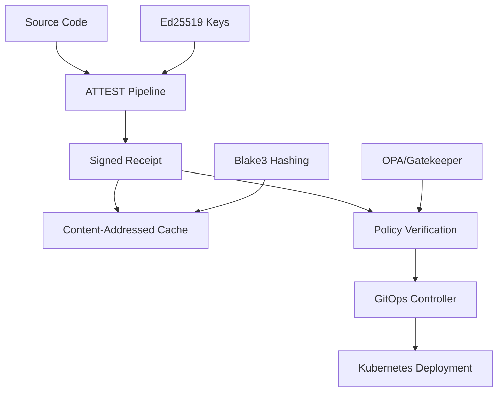

## 1. Introduction

Continuum ATTEST is a next-generation CI/CD platform that provides **cryptographic attestation** for every step of your build and deployment process. Unlike traditional CI/CD systems, Continuum ATTEST creates tamper-proof records of what actually happened during your pipeline execution.

ATTEST stands for **Authenticated, Traceable, Transparent, Executable, Secure, Trusted** pipelines. It combines modern CI/CD capabilities with advanced cryptographic techniques to ensure:

- **Authenticity**: Every build step is cryptographically signed
- **Integrity**: Outputs are content-addressed and tamper-evident  
- **Provenance**: Complete audit trail from source to deployment
- **Reproducibility**: Bit-for-bit identical builds guaranteed
- **Compliance**: Built-in support for regulatory frameworks

## 2. Key Differentiators

### 2.1 Cryptographic Attestation

Every pipeline step is signed with **Ed25519** signatures, creating unforgeable proof of execution. This enables:

- Supply chain security
- Non-repudiation of builds
- Tamper detection
- Compliance auditing

### 2.2 Content-Addressed Caching

Using **Blake3** hashing, ATTEST provides:

- Deterministic cache keys
- Automatic deduplication
- Secure cache verification
- Dramatic performance improvements

### 2.3 GitOps Native

Built-in Kubernetes integration with:

- Custom Resource Definitions (CRDs)
- Automated verification before deployment
- Policy enforcement at deploy time
- Multi-cluster consistency

### 2.4 Policy as Code

Integrated **OPA/Gatekeeper** support for:

- Compliance enforcement
- Security policies
- Governance rules
- Audit requirements

## 3. Architecture

## 4. Use Cases

### 4.1 Software Supply Chain Security

- **SLSA compliance** for supply chain integrity
- **In-toto compatibility** for software bill of materials
- **Zero-trust verification** of build artifacts
- **Provenance tracking** across the entire pipeline

### 4.2 Regulatory Compliance

- **SOX compliance** for financial services
- **HIPAA compliance** for healthcare
- **PCI-DSS compliance** for payment processing
- **ISO 27001** for information security

### 4.3 Enterprise DevOps

- **Multi-team governance** with policy enforcement
- **Audit-ready pipelines** with complete traceability
- **Performance optimization** through intelligent caching
- **GitOps workflows** with verification

### 4.4 Open Source Projects

- **Reproducible builds** for transparency
- **Contributor verification** with signed commits
- **Release integrity** with cryptographic proof
- **Community trust** through verifiable processes

## 5. Comparison with Traditional CI/CD

| Feature | Traditional CI/CD | ATTEST |
|---------|------------------|---------|
| Build Verification | Logs only | Cryptographic signatures |
| Cache Strategy | Time-based | Content-addressed |
| Supply Chain Security | Manual | Built-in attestation |
| Compliance | External tools | Native support |
| Reproducibility | Best effort | Guaranteed |
| Audit Trail | Limited | Complete provenance |

## 6. Getting Started

1. **[Install Continuum ATTEST](installation.md)** on your system
2. **[Initialize your first project](first-steps.md)** with `attest init`
3. **[Configure your pipeline](pipeline-configuration.md)** in `attest.yaml`
4. **[Run with verification](first-steps.md#running-pipelines)** using `attest run --verify --sign`

## 7. Community and Support

- **Documentation**: Comprehensive guides and examples
- **GitHub Issues**: Bug reports and feature requests
- **Community Forum**: Questions and discussions
- **Commercial Support**: Enterprise licensing and support

Continuum ATTEST represents the future of secure, verifiable CI/CD - where every build is provable, every deployment is traceable, and every artifact is authenticated.
