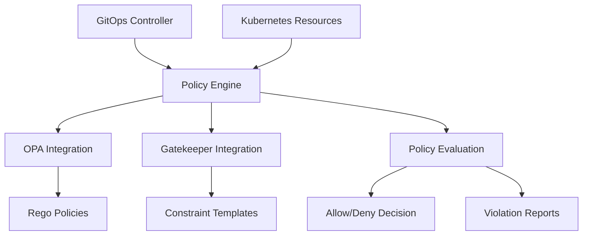

## 1. Overview

ATTEST provides comprehensive policy enforcement and governance capabilities through integration with Open Policy Agent (OPA) and Gatekeeper, enabling organizations to maintain security, compliance, and operational standards across all deployments.

## 2. Policy Engine Architecture



## 3. Policy Types

### Security Policies

Enforce security best practices:

```rego
package attest.security

# Deny containers without ATTEST attestation
violation[{"violated": true, "message": msg, "severity": "high"}] {
    input.resource.kind == "Pod"
    container := input.resource.spec.containers[_]
    not has_attest_attestation(container.image)
    msg := sprintf("Container image '%v' lacks required ATTEST attestation", [container.image])
}

# Deny privileged containers
violation[{"violated": true, "message": msg, "severity": "critical"}] {
    input.resource.kind in ["Pod", "Deployment"]
    container := get_containers[_]
    container.securityContext.privileged == true
    msg := sprintf("Privileged containers are not allowed: %v", [container.name])
}
```

### Deployment Policies

Ensure deployment best practices:

```rego
package attest.deployment

# Require ATTEST receipt for all deployments
violation[{"violated": true, "message": msg, "severity": "critical"}] {
    input.resource.kind == "Deployment"
    not has_attest_receipt
    msg := "Deployment must include valid ATTEST receipt"
}

# Enforce minimum replica count for production
violation[{"violated": true, "message": msg, "severity": "medium"}] {
    input.resource.kind == "Deployment"
    is_production_namespace
    input.resource.spec.replicas < 2
    msg := "Production deployments must have at least 2 replicas for high availability"
}
```

### Compliance Policies

Meet regulatory requirements:

```rego
package attest.compliance

# SOC2 Compliance: Audit logging requirements
violation[{"violated": true, "message": msg, "severity": "high"}] {
    input.resource.kind == "Deployment"
    is_production_namespace
    not has_audit_logging_enabled
    msg := "Production deployments must enable audit logging for SOC2 compliance"
}

# GDPR: Data protection annotations
violation[{"violated": true, "message": msg, "severity": "high"}] {
    input.resource.kind == "Deployment"
    processes_personal_data
    not has_data_protection_annotations
    msg := "Applications processing personal data must have GDPR data protection annotations"
}
```

## 4. Policy Configuration

### Global Policy Settings

```yaml
# ~/.config/attest/policies.yaml
policy:
  enabled: true
  opa_enabled: true
  gatekeeper_enabled: true
  fail_on_violation: true
  
  # Policy sources
  policy_bundle_url: "https://policies.company.com/attest-bundle"
  policy_bundle_path: "policies/"
  
  # Custom policies
  custom_policies:
    - name: "custom-security"
      description: "Custom security policy"
      level: "Cluster"
      severity: "High"
      rego_code: |
        package custom.security
        violation[{"violated": true, "message": msg}] {
          # Policy logic here
        }
```

### Project-Level Policies

```yaml
# .attest/policies.yaml
policies:
  - name: "image-security"
    enabled: true
    enforcement: "strict"
    parameters:
      trusted_registries:
        - "gcr.io/"
        - "registry.company.com/"
      require_attestation: true
      
  - name: "resource-limits"
    enabled: true
    enforcement: "warn"
    parameters:
      max_cpu: "2000m"
      max_memory: "4Gi"
      require_limits: true
```

## 5. Gatekeeper Integration

### Constraint Templates

ATTEST creates specialized constraint templates:

```yaml
apiVersion: templates.gatekeeper.sh/v1beta1
kind: ConstraintTemplate
metadata:
  name: attestimagepolicy
spec:
  crd:
    spec:
      names:
        kind: AttestImagePolicy
      validation:
        properties:
          allowedRegistries:
            type: array
            items:
              type: string
          requireAttestation:
            type: boolean
  targets:
    - target: admission.k8s.gatekeeper.sh
      rego: |
        package attestimagepolicy
        
        violation[{"msg": msg}] {
            container := input.review.object.spec.containers[_]
            not allowed_registry(container.image)
            msg := sprintf("Container image '%v' is not from an allowed registry", [container.image])
        }
```

### Constraint Instances

```yaml
apiVersion: constraints.gatekeeper.sh/v1beta1
kind: AttestImagePolicy
metadata:
  name: company-image-policy
spec:
  match:
    kinds:
      - apiGroups: ["apps"]
        kinds: ["Deployment"]
    namespaces: ["production", "staging"]
  parameters:
    allowedRegistries:
      - "gcr.io/company/"
      - "registry.company.com/"
    requireAttestation: true
```

## 6. Policy Exemptions

### Temporary Exemptions

```yaml
exemptions:
  - policy_name: "attest-security"
    resource_kind: "Pod"
    resource_name: "legacy-monitoring"
    resource_namespace: "monitoring"
    reason: "Legacy monitoring tool pending security upgrade"
    expires_at: "2024-06-30T23:59:59Z"
    approved_by: "security-team@company.com"
```

### Annotation-Based Exemptions

```yaml
apiVersion: v1
kind: Pod
metadata:
  name: exempted-pod
  annotations:
    policy.attest.continuu.ms/exempt: "true"
    policy.attest.continuu.ms/exempt-reason: "Emergency hotfix deployment"
    policy.attest.continuu.ms/exempt-approved-by: "incident-commander@company.com"
    policy.attest.continuu.ms/exempt-expires: "2024-02-01T12:00:00Z"
spec:
  # Pod specification
```

## 7. Policy Testing

### Automated Policy Testing

```bash
# Test all policies with examples
attest policy test-all

# Test specific policy
attest policy test attest-security

# Test against specific resource
attest policy test attest-security --resource k8s/deployment.yaml
```

### Policy Validation

```bash
# Validate policy syntax
attest policy validate policies/security.rego

# Validate policy bundle
attest policy validate-bundle https://policies.company.com/bundle

# Check policy conflicts
attest policy conflicts --detailed
```

## 8. Compliance Frameworks

### SOC2 Type II

```yaml
compliance:
  soc2:
    enabled: true
    controls:
      - control: "CC6.1"
        policy: "access-control"
        description: "Logical access security measures"
      - control: "CC6.3"
        policy: "authentication"
        description: "Multi-factor authentication"
      - control: "CC7.2"
        policy: "system-monitoring"
        description: "System monitoring and logging"
```

### GDPR Compliance

```yaml
compliance:
  gdpr:
    enabled: true
    data_protection:
      require_annotations: true
      required_annotations:
        - "gdpr.attest.continuu.ms/lawful-basis"
        - "gdpr.attest.continuu.ms/data-controller"
        - "gdpr.attest.continuu.ms/retention-period"
    privacy_by_design: true
```

### HIPAA Compliance

```yaml
compliance:
  hipaa:
    enabled: true
    encryption:
      at_rest: required
      in_transit: required
    access_controls:
      minimum_necessary: true
      audit_logging: required
    data_classification:
      phi_detection: enabled
```

## 9. Policy Monitoring

### Prometheus Metrics

```
# Policy evaluations
attest_policy_evaluations_total{policy="attest-security",result="passed"}
attest_policy_evaluations_total{policy="attest-security",result="failed"}

# Violation severity
attest_policy_violation_severity{severity="critical",policy="attest-security"}

# Engine performance
attest_policy_evaluation_duration_seconds{engine="opa"}
attest_policy_evaluation_duration_seconds{engine="gatekeeper"}
```

### Violation Alerts

```yaml
# Prometheus AlertManager rules
groups:
- name: attest-policy
  rules:
  - alert: CriticalPolicyViolation
    expr: increase(attest_policy_violation_severity{severity="critical"}[5m]) > 0
    for: 0m
    labels:
      severity: critical
    annotations:
      summary: "Critical policy violation detected"
      description: "{{ $labels.policy }} policy has {{ $value }} critical violations"
```

## 10. Policy as Code

### Version Control Integration

```bash
# Policy repository structure
policies/
├── security/
│   ├── container-security.rego
│   ├── network-policies.rego
│   └── rbac-policies.rego
├── compliance/
│   ├── soc2.rego
│   ├── gdpr.rego
│   └── hipaa.rego
├── deployment/
│   ├── resource-limits.rego
│   ├── health-checks.rego
│   └── availability.rego
└── tests/
    ├── security_test.rego
    ├── compliance_test.rego
    └── deployment_test.rego
```

### CI/CD Pipeline Integration

```yaml
# .github/workflows/policy-validation.yml
name: Policy Validation
on:
  pull_request:
    paths: ['policies/**']

jobs:
  validate:
    runs-on: ubuntu-latest
    steps:
      - uses: actions/checkout@v4
      
      - name: Validate Policies
        run: |
          attest policy validate policies/
          attest policy test policies/
          
      - name: Security Scan
        run: |
          attest policy scan --format sarif --output policy-scan.sarif
          
      - name: Upload Results
        uses: github/codeql-action/upload-sarif@v2
        with:
          sarif_file: policy-scan.sarif
```

## 11. Governance Workflows

### Policy Review Process

```yaml
# .attest/governance.yaml
governance:
  policy_approval:
    required_reviewers: 2
    required_teams: ["security-team", "compliance-team"]
    auto_merge: false
    
  exemption_approval:
    required_approvers: 1
    required_teams: ["security-team"]
    max_duration: "30d"
    
  emergency_override:
    enabled: true
    required_approvers: 2
    audit_trail: required
```

### Approval Workflows

```bash
# Request policy exemption
attest policy exempt \
  --policy attest-security \
  --resource Pod/monitoring/legacy-app \
  --reason "Legacy app migration in progress" \
  --duration 30d \
  --approver security-team@company.com

# Review pending exemptions
attest policy exemptions list --status pending

# Approve exemption
attest policy exempt approve exemption-123 \
  --approver alice@company.com \
  --comment "Approved for migration period"
```

## 12. Advanced Policy Features

### Dynamic Policy Parameters

```rego
package attest.dynamic

# Use external data for policy decisions
violation[{"violated": true, "message": msg}] {
    container := input.resource.spec.containers[_]
    vulnerability_data := http.send({
        "method": "GET",
        "url": sprintf("https://vuln-db.company.com/scan/%s", [container.image])
    })
    vulnerability_data.status_code == 200
    vulnerabilities := json.unmarshal(vulnerability_data.body)
    count(vulnerabilities.critical) > 0
    msg := sprintf("Container image %s has %d critical vulnerabilities", [container.image, count(vulnerabilities.critical)])
}
```

### Contextual Policies

```rego
package attest.context

# Different rules for different environments
violation[{"violated": true, "message": msg}] {
    input.resource.kind == "Deployment"
    environment := input.resource.metadata.labels["environment"]
    environment == "production"
    not has_production_requirements
    msg := "Production deployments must meet stricter requirements"
}

has_production_requirements {
    input.resource.spec.replicas >= 3
    input.resource.spec.template.spec.containers[_].resources.limits
    input.resource.metadata.annotations["monitoring.company.com/enabled"] == "true"
}
```

## 13. Policy Development Tools

### OPA Playground Integration

```bash
# Test policies interactively
attest policy playground \
  --policy policies/security.rego \
  --input examples/deployment.yaml

# Generate test cases
attest policy generate-tests \
  --policy policies/security.rego \
  --output tests/security_test.rego
```

### Policy Performance Analysis

```bash
# Profile policy performance
attest policy profile policies/ \
  --benchmark-data examples/ \
  --output profile-report.json

# Optimize slow policies
attest policy optimize policies/slow-policy.rego \
  --suggestions
```

## 14. Integration Examples

### Jenkins Pipeline

```groovy
pipeline {
    agent any
    stages {
        stage('Policy Validation') {
            steps {
                script {
                    sh 'attest policy validate k8s/'
                    def violations = sh(
                        script: 'attest policy check k8s/ --format json',
                        returnStdout: true
                    )
                    def result = readJSON text: violations
                    if (result.violations > 0) {
                        error "Policy violations found: ${result.violations}"
                    }
                }
            }
        }
    }
}
```

### GitLab CI

```yaml
policy-check:
  stage: validate
  image: attestci/attest:latest
  script:
    - attest policy validate manifests/
    - attest policy check manifests/ --strict
  artifacts:
    reports:
      junit: policy-results.xml
  only:
    changes:
      - manifests/**/*
      - policies/**/*
```

## 15. Best Practices

### Policy Design

1. **Start with warnings** before enforcing denials
2. **Use clear, descriptive messages** for violations
3. **Implement gradual rollout** for new policies
4. **Test thoroughly** before production deployment
5. **Maintain policy documentation** and examples

### Performance Optimization

1. **Minimize external data calls** in policies
2. **Use efficient Rego patterns** for complex logic
3. **Cache policy evaluation results** when possible
4. **Monitor policy evaluation time** and optimize slow rules
5. **Batch policy evaluations** for multiple resources

### Security Considerations

1. **Protect policy source code** with appropriate access controls
2. **Sign policy bundles** to ensure integrity
3. **Audit policy changes** and maintain change history
4. **Implement break-glass procedures** for emergencies
5. **Regular security reviews** of policy logic

## 16. Troubleshooting

### Common Issues

```bash
# Policy not being applied
kubectl get constraints -A
kubectl describe constraint policy-name

# OPA evaluation failures
kubectl logs -n gatekeeper-system -l app=gatekeeper-controller

# Performance issues
attest policy profile --verbose policies/
```

### Debug Mode

```bash
# Enable detailed policy logging
attest config set policy.debug true

# Trace policy evaluation
attest policy trace \
  --policy policies/security.rego \
  --input examples/pod.yaml \
  --verbose
```

The ATTEST policy and governance system provides enterprise-grade policy enforcement with comprehensive compliance support, ensuring your deployments meet organizational standards and regulatory requirements.